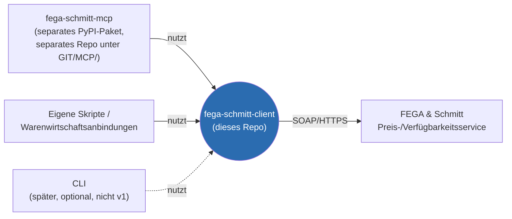
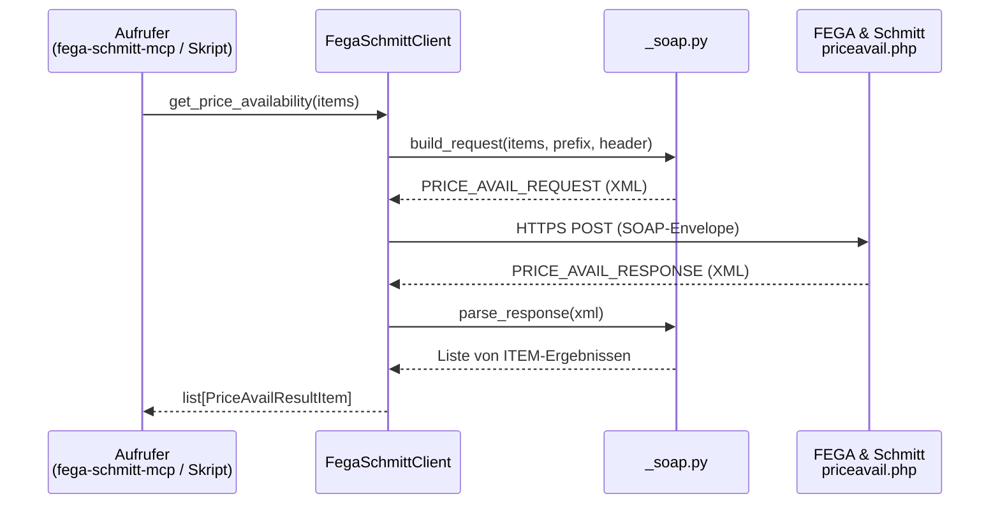

# Architektur

> v1 (SOAP-Preis-/Verfügbarkeit) sowie eine erste IDS-Erweiterung (Warenkorb senden/empfangen) sind implementiert. `get_price_availability` wurde zusätzlich live gegen den echten FEGA & Schmitt-Server verifiziert (siehe Abschnitt 4). Dieses Dokument beschreibt sowohl die bestehende als auch die noch geplante Architektur, auf Basis der FEGA & Schmitt/Branchen-Spezifikationen in [`specs/`](specs/).

## 1. Kontext & Abgrenzung

`fega-schmitt-client` ist die **einzige Stelle**, an der Wissen über die konkreten FEGA & Schmitt-Protokolle (Wire-Format, Auth, Fehlercodes) existiert. Alles, was HTTP/SOAP/XML im Detail versteht, gehört hierher — nicht in den MCP-Wrapper.



`fega-schmitt-mcp` verpackt die Funktionen dieser Library als MCP-Tools für KI-Assistenten.

Diese Trennung ist bewusst: Die Library ist testbar, versionierbar und auf PyPI installierbar, ohne dass ein MCP-Host beteiligt sein muss. Der MCP-Server bleibt dadurch dünn (siehe Architektur von `fega-schmitt-mcp`) und die Protokoll-Logik ist wiederverwendbar für andere Integrationen (z. B. eine direkte Anbindung an ein Warenwirtschaftssystem ohne KI-Assistenten).

FEGA & Schmitt stellt Kunden drei technisch unabhängige Schnittstellen zur Verfügung. Sie unterscheiden sich stark in Protokoll, Interaktionsmuster und Automatisierbarkeit:

| | SOAP Preis-/Verfügbarkeit | IDS-Schnittstelle | UGL Version 4 |
|---|---|---|---|
| Quelle | FEGA & Schmitt-eigene Doku | BVBS/ITEK-Branchenstandard, v2.5 | GC-Gruppe-Branchenstandard (SHK) |
| Protokoll | SOAP 1.1 / XML über HTTPS POST | HTTP-Formular-POST (`multipart/form-data`) an eine Shop-URL, Rückkanal über "Hook-URL" | Flatfile (ASCII, feste Satzlänge 200 Byte) über FTP oder Webportal-Verzeichnis |
| Funktionsumfang | Ausschließlich Preis-/Verfügbarkeitsabfrage, bis zu 1000 Artikel pro Anfrage. Ergebnis pro Position: Verfügbarkeitsstatus (voll/teilweise/nicht verfügbar/Beschaffung/keine Aussage), Lagerort, Netto-/Brutto-/Listenpreis, Metall-/Kupferzuschläge. **Kein** Bestellauslösen, keine Auftragsbestätigung, keine Artikel-Stammdatenpflege — reine Live-Abfrage. | 7 Funktionen: **Warenkorb senden/empfangen** (Bestellvorbereitung inkl. Bezug auf bestehende Angebote/Abrufaufträge), **Artikeldeeplink** (Sprung zu einer Artikeldetailseite im Shop), **Artikelsuche** (Freitextsuche mit Ergebnisrückgabe an die Handwerkersoftware), **Heatinglabel senden** (ErP-Verbundlabel-Berechnung für Heizungsanlagen aus einer Artikelliste), dazu die Hilfsfunktionen Login-Informationen und Schnittstellenversion. Deckt damit potenziell den kompletten Bestellvorbereitungs-Workflow inkl. Bestellauslösung im Shop ab — aber immer mit einem Menschen im Loop, da jede Aktion ein Browserfenster im GH-Shop öffnet. | Kompletter Auftragsabwicklungs-Workflow als Batch-Dokumente: **Preisanfrage** (Anfrageart `AN` → Antwort `PA` Preisangebot), **Abruf-/Lieferaufträge** (`TB`/`BE`/`A0`/`A1`/`A2` → Antwort `AB` Auftragsbestätigung, jeweils mit Bezug auf ein vorheriges Angebot/eine Auftragsbestätigung über die Vorgangsnummer). Je Position (Satzart `POA`): Menge, Brutto-/Nettopreis, bis zu zwei Rabattstufen, Alternativ-/Jumbo-Kennzeichen, Lagerkennzeichen (Lagerware `L`/Bestellware `B`), Kennzeichen "technische Klärung erforderlich". Zusätzlich eigene Zuschlagssätze (`POZ`) für Kupfer-/Metallzuschlag, Verpackung, Versicherung, Teuerung, Recycling, Schnittlänge, Mindermenge und Fracht, wahlweise positionsbezogen oder als eigenständige Vorgangsposition. **Kein** Live-Preis-/Verfügbarkeits-Check wie SOAP, sondern asynchrone Auftragsdokumente im Tagesbatch. |
| Interaktionsmuster | Synchron, zustandslos, Server-zu-Server | Öffnet ein Browserfenster im GH-Shop; Nutzer agiert dort manuell; Shop schickt Ergebnis per Formular-POST an die Hook-URL zurück ("halbautomatisch") | Asynchron/Batch: Datei ablegen, später Antwortdatei abholen |
| Auth | Kundennummer + Shop-Kennwort im XML-Body je Anfrage | Kundennummer/Benutzername/Passwort als POST-Parameter beim Öffnen des Shops | Vermutlich FTP-Zugangsdaten (nicht in den ersten Seiten der Spec spezifiziert) |
| Als Funktionsaufruf abbildbar? | **Ja** — klassischer Request/Response-API-Aufruf | **Nein, nicht direkt** — benötigt Browser-Kontext bzw. Nachbau der Shop-Formularlogik | **Nein, nicht direkt** — benötigt Scheduler/Polling |

**Bezug zur OCI-Schnittstelle:** Der Rückkanal von IDS ("Formular-POST an die Hook-URL") ist laut Spezifikation explizit an die **OCI-Schnittstelle** (Open Catalog Interface — ursprünglich von SAP für Procurement-Punch-Out-Kataloge entwickelt, seither de-facto-Standard für Lieferanten-Webshop-Anbindungen an ERP-/Warenwirtschaftssysteme) angelehnt: "Die Übernahme der Daten erfolgt als Übertragung eines Formulars an die HOOK-URL analog der OCI Schnittstelle" (siehe [`specs/IDS_Schnittstelle_2_5_final_NEU.pdf`](specs/IDS_Schnittstelle_2_5_final_NEU.pdf), Abschnitt 5.1c/5.4f). Wichtige Einschränkung dieser Analogie: "reines" OCI überträgt pro Artikelposition einzelne Formularfelder (`NEW_ITEM-DESCRIPTION[n]`, `NEW_ITEM-QUANTITY[n]`, `NEW_ITEM-PRICE[n]`, …), während IDS den kompletten Warenkorb als ein einziges XML-Dokument in einem Formularfeld (`warenkorb`) überträgt. Nur der Transportmechanismus (Browser-Redirect + Formular-POST an eine Hook-/Rücksprung-URL) folgt dem OCI-Muster, das Datenformat ist eigenständig (siehe Abschnitt 7.1).

**Konsequenz für den Zuschnitt:** v1 der Library deckt ausschließlich den SOAP-Preis-/Verfügbarkeitsservice als reine Python-Funktionsaufrufe ab. IDS und UGL4 werden in Abschnitt 7 als mögliche spätere Erweiterungen *derselben Library* skizziert (nicht als eigene Repos), da beide letztlich auch "FEGA & Schmitt ansprechen" — nur mit anderer Transportlogik dahinter.

## 2. Paketaufbau (v1, Vorschlag)

```
fega_schmitt_client/
    __init__.py        # Public API: FegaSchmittClient, Modelle, Exceptions
    price_avail.py      # SOAP-Client für den Preis-/Verfügbarkeitsservice
    models.py             # PriceAvailRequestItem, PriceAvailResultItem, Surcharge, ...
    exceptions.py          # FegaApiError, FegaAuthError, FegaTransportError, ...
    _soap.py                 # Low-Level: SOAP-Envelope bauen/parsen (intern, kein Public API)

    ids/                       # IDS-Erweiterung (siehe Abschnitt 7.1) - eigener Namespace, nicht Teil der SOAP-Public-API
        __init__.py              # build_cart_request, parse_cart_callback, Cart, CartItem, ...
        models.py                 # Cart, CartItem, Address, OrderInfo, RawMaterialShare, ...
        cart.py                    # Warenkorb senden/empfangen (implementiert)
        _xml.py                     # Low-Level: Warenkorb-XML bauen/parsen (intern, kein Public API)

    # spätere Erweiterungen (siehe Abschnitt 7), noch nicht umgesetzt:
    # ids: Artikeldeeplink, Artikelsuche, Login-Informationen, Schnittstellenversion, Heatinglabel
    # ugl4/                     # UGL4 Flatfile-Ex-/Import
    # datanorm/                  # DATANORM v5 Preislisten-Import (siehe Abschnitt 7.3)
```

`FegaSchmittClient` ist der einzige öffentliche Einstiegspunkt in v1; interne Transportdetails (`_soap.py`) sind nicht Teil der Public API und können sich ändern, ohne SemVer-Major auszulösen.

## 3. Ablauf `get_price_availability`



1. Aufrufer (z. B. `fega-schmitt-mcp` oder ein eigenes Skript) ruft `client.get_price_availability(items, ...)` mit einer Liste von `PriceAvailRequestItem` auf (max. 1000 Positionen laut Spezifikation, siehe [`specs/Schnittstellenbeschreibung_SOAP.pdf`](specs/Schnittstellenbeschreibung_SOAP.pdf), Abschnitt "Allgemeiner Ablauf").
2. `price_avail.py` baut über `_soap.py` eine `PRICE_AVAIL_REQUEST`-Nachricht:
   - `PREFIX`: Firmennummer ("50"), Kundennummer, Shop-Kennwort, eine pro Aufruf generierte `TRANSACTION_ID`
   - `HEADER`: Versandart (Lieferung/Abholung), Zielwährung ("EUR"), optional PLZ/Länderkennzeichen für lieferabhängige Verfügbarkeit
   - `ITEM_LIST`: eine `ITEM`-Position je angefragtem Artikel, mit fortlaufender `LINE_ITEM_NUMBER` zur Zuordnung der Antwort
3. HTTPS-POST des SOAP-Envelopes an `https://soap.fega.de/priceavail.php`.
4. `_soap.py` parst `PRICE_AVAIL_RESPONSE` und mappt jede `ITEM`-Position zurück auf die ursprüngliche Anfrageposition (über `LINE_ITEM_NUMBER`).
5. `get_price_availability` gibt eine Liste von `PriceAvailResultItem` zurück (siehe Abschnitt 5) — Fehler auf einzelnen Positionen führen nicht zum Abbruch des gesamten Aufrufs, sondern werden je Position im Ergebnis abgebildet (entspricht dem Verhalten der Schnittstelle selbst: Returncode ist je Position, nicht global).
6. Reine Transportfehler (Timeout, HTTP-Statuscode ≠ 200, ungültiges SOAP-Envelope, Auth komplett abgelehnt) lösen eine Exception aus (`FegaTransportError` / `FegaAuthError`), da hier keine sinnvolle Teilantwort existiert.

## 4. Fehler- und Hinweisbehandlung (Returncodes)

Aus [`specs/Schnittstellenbeschreibung_SOAP.pdf`](specs/Schnittstellenbeschreibung_SOAP.pdf), Abschnitt 4:

| Prefix | Bedeutung | Abbildung im Ergebnis |
|---|---|---|
| `I…` (z. B. `I720`) | Erfolgreiche Ermittlung | `PriceAvailResultItem.status = "ok"` |
| `H…` (z. B. `H014`, Abholverzögerung) | Erfolgreich, aber mit Hinweis | `status = "hint"`, `return_code_text` gesetzt |
| `E…` (z. B. `E999`: unbekannte Artikelnummer, unbekannter ISO-Mengeneinheitscode, Mengenüberlauf) | Fehler bei dieser Position | `status = "error"`, `return_code_text` gesetzt, restliche Werte `None` |

Der `RETURNCODE_TEXT` wird unverändert durchgereicht, da er laut Spezifikation für die Anzeige beim Endnutzer vorgesehen ist.

**Live-Verifikation:** Ein Aufruf gegen den echten Server mit einer realen Artikelnummer (121350) lieferte `I720` mit korrekten Preis-, Verfügbarkeits- und Kupferzuschlagsdaten — die komplette Kette (SOAP-Envelope bauen, HTTPS-POST, Envelope parsen, `SURCHARGE_REBATE_LIST`) funktioniert also gegen die Produktivumgebung, nicht nur gegen den Mock-Server in den Tests. Ein Aufruf mit einer erfundenen Artikelnummer (`TEST123`, aus dem Spec-Beispiel) lieferte dagegen `E999`/Fehler 216 mit dem Text "Bitte pruefen Sie Ihre Anmeldedaten" bei HTTP 200 — trotz gültiger Zugangsdaten. Der Text weicht von der in der Spec dokumentierten Bedeutung für Fehler 216 ("Artikelnummer unbekannt") ab, deutet aber vermutlich trotzdem auf eine unbekannte Artikelnummer hin, nicht auf ein echtes Auth-Problem. Wichtige Erkenntnis für Abschnitt 6: FEGA scheint Ablehnungen offenbar generell per Item-Returncode statt per HTTP-Status zu melden — `FegaAuthError` (aktuell nur bei HTTP 401/403) wurde damit noch nicht mit tatsächlich falschen Zugangsdaten verifiziert und könnte in der Praxis nie auslösen.

## 5. Datenmodell (geplant)

```python
@dataclass
class PriceAvailRequestItem:
    material_number: str        # FEGA & Schmitt-Artikelnummer, Pflicht
    quantity: Decimal            # Pflicht
    unit: str | None = None      # ISO-Code, z. B. "PCE", "MTR"; optional

@dataclass
class Surcharge:
    code: str
    text: str
    amount: Decimal

@dataclass
class PriceAvailResultItem:
    line_item_number: int
    material_number: str
    status: Literal["ok", "hint", "error"]
    return_code: str
    return_code_text: str
    availability_status: Literal["V", "T", "N", "B", "0"] | None   # voll/teilw./nicht verfügbar/Beschaffung/keine Aussage
    warehouse_number: str | None
    warehouse_name: str | None
    price_amount: Decimal | None      # Nettowert vor Zu-/Abschlägen
    net_amount: Decimal | None        # Nettowert inkl. Zu-/Abschläge, vor Steuer
    list_amount: Decimal | None       # Listenpreis
    surcharges: list[Surcharge]       # z. B. Kupfer-/Metallzuschlag
```

Die Felder orientieren sich 1:1 an der XML-Struktur aus der Spezifikation (Abschnitt 3.3 "Nachrichtenaufbau Antwort"), um verlustfrei zu bleiben.

## 6. Sicherheit & Credential-Handling

- Kundennummer und Shop-Kennwort werden dem `FegaSchmittClient`-Konstruktor explizit übergeben (kein implizites Lesen von Umgebungsvariablen in der Library selbst — das ist Aufgabe des jeweiligen Aufrufers, z. B. des MCP-Wrappers).
- Die Schnittstelle verlangt HTTPS (`https://soap.fega.de/...`); Klartext-HTTP wird nicht unterstützt und nicht implementiert.
- Da jede Anfrage Kundennummer + Kennwort im Klartext-XML-Body enthält, maskiert das Logging der Library das Kennwort standardmäßig (nie im Klartext loggen).
- Keine Persistierung von Preisdaten in v1 — jeder Aufruf ist eine Live-Abfrage. Ein optionaler kurzlebiger In-Memory-Cache (TTL im Minutenbereich) ist als spätere Optimierung denkbar, aber wegen tagesaktueller Preise (siehe `SURCHARGE_REBATE_AMOUNT`-Hinweis "wertmäßig akt. Tagespreisen") mit Vorsicht zu dosieren.

## 7. Bewusst nicht in v1 abgedeckt

### 7.1 IDS-Schnittstelle (BVBS/ITEK, v2.5)

Beschrieben in [`specs/IDS_Schnittstelle_2_5_final_NEU.pdf`](specs/IDS_Schnittstelle_2_5_final_NEU.pdf). Diese Schnittstelle ist ein **Branchenstandard**, kein FEGA & Schmitt-spezifisches Protokoll — ob und wie FEGA & Schmitt ihn im eigenen Webshop implementiert, ist ungeklärt (offener Punkt, siehe README). Zum Rückkanal per Hook-URL und dem Bezug zu OCI siehe Abschnitt 1.

**Umgesetzt:** `Warenkorb senden` (Aktion `WKS`) und das Parsen eines empfangenen Warenkorbs (`Warenkorb empfangen`, Aktion `WKE`), als eigenes Untermodul `fega_schmitt_client.ids` mit `build_cart_request(cart, shop_url, hook_url=None, ...)` und `parse_cart_callback(xml)`. Keine Browser-Automatisierung nötig: `build_cart_request` liefert nur die Formularfelder für den `multipart/form-data`-POST (inkl. XML-Warenkorb im `warenkorb`-Feld) — das tatsächliche Öffnen im Browser bzw. der Empfang am Hook-URL-Endpunkt bleibt bewusst außerhalb der Library (Aufgabe des Aufrufers, z. B. `fega-schmitt-mcp`, siehe Abschnitt 1). `hook_url` ist optional: ohne sie lässt sich der Warenkorb weiterhin öffnen, nur der automatische Rücklauf entfällt dann.

Warum (noch) nicht der Rest der IDS-Schnittstelle:

- Artikeldeeplink, Artikelsuche, Login-Informationen und Schnittstellenversion öffnen jeweils ein Browserfenster, in dem der Nutzer manuell agiert ("Blackbox") — das lässt sich nicht als Python-Rückgabewert abbilden, höchstens als vorbereitete Formularfelder analog zu `build_cart_request`.
- Referenzierte XSD-Schemas (`Warenkorb_senden.xsd`, `Warenkorb_empfangen_2-5.xsd`, `heatinglabel_senden.xsd`, `heatinglabel_empfangen.xsd`) liegen der vorliegenden PDF nicht bei — `ids.cart` basiert auf der tabellarischen Feldbeschreibung in Abschnitt 7.1 der Spec, nicht auf den XSDs selbst.
- Heatinglabel (ErP-Label-Berechnung für Verbundanlagen) ist funktional unabhängig vom eigentlichen Ziel dieser Library (Preis/Verfügbarkeit/Warenkorb) und noch nicht angegangen.

### 7.2 UGL Version 4

Beschrieben in [`specs/ugl4neutral.pdf`](specs/ugl4neutral.pdf). Ebenfalls ein **Branchenstandard** (SHK-Großhandel/GC-Gruppe), keine FEGA & Schmitt-spezifische Erfindung.

Warum nicht v1:

- Datenaustausch erfolgt batchweise als Datei (feste Satzlänge, 200 Byte/Satz) über FTP oder ein Portalverzeichnis — kein synchrones Request/Response.
- Eine Library-Funktion bräuchte entweder Polling ("Antwortdatei liegt vor?") oder einen Hintergrund-Job, der Dateien abholt — ein grundsätzlich anderes Betriebsmodell als der stdio-basierte Preis-/Verfügbarkeits-Aufruf.
- Zugangsdaten/Verzeichnisstruktur beim FEGA & Schmitt-FTP sind nicht bekannt (offener Punkt).
- Falls später umgesetzt: eigenes Untermodul `fega_schmitt_client.ugl4` mit reinen Dateiformat-Funktionen (`parse_response_file(...)`, `build_inquiry_file(...)`) — der eigentliche FTP-Transport/Scheduling bliebe bewusst außerhalb der Library, da das ein Betriebs-/Infrastrukturthema ist, kein API-Zugriffsthema.

### 7.3 DATANORM v5 (Artikel-Stammdaten/Preislisten)

Kein Live-Request/Response-Protokoll wie SOAP, sondern ein **Branchenstandard für den Austausch von Artikel-Stammdaten und Preislisten** als Datei — ähnlich UGL4 im Betriebsmodell (Datei statt API-Aufruf), aber ein anderes, älteres und deutlich weiter verbreitetes Format. Die SOAP-Spezifikation selbst verweist darauf als Quelle der `MATERIAL_NUMBER`: "die FEGA & Schmitt – Artikelnummer, die Sie über eine andere Schnittstelle (z.B. DATANORM) bezogen haben" (siehe [`specs/Schnittstellenbeschreibung_SOAP.pdf`](specs/Schnittstellenbeschreibung_SOAP.pdf), Abschnitt 1). DATANORM ist damit nicht nur ein optionales Zusatzformat, sondern die naheliegende Quelle für genau die Artikelnummern, die `get_price_availability` als Eingabe benötigt.

Status: DATANORM v5-Zugang sowie Offline-Zugang (FTP) bei FEGA & Schmitt sind beantragt, aber noch nicht bestätigt und keine Format-Spezifikation im Repo vorhanden (offener Punkt, siehe README). Sobald Zugangsdaten und Spezifikation vorliegen, ist ein eigenes Untermodul `fega_schmitt_client.datanorm` mit reinen Datei-Parsing-Funktionen (analog zu UGL4, z. B. `parse_price_file(...)`) der naheliegende Zuschnitt — der FTP-Transport selbst bliebe aus denselben Gründen wie bei UGL4 außerhalb der Library.

## 8. Technologiewahl (Vorschlag, noch nicht festgelegt)

Konsistent mit anderen Python-Bibliotheken in diesem Workspace (z. B. `vnbdigital-client`):

- **Paketverwaltung:** `uv`, Linting/Formatting mit `ruff`
- **SOAP/XML:** leichtgewichtiges XML-Templating (`lxml`/`xml.etree`) statt eines vollen WSDL-getriebenen SOAP-Stacks wie `zeep` — die Schnittstelle ist klein, statisch und ohne WSDL-Dokument in der Spec referenziert
- **HTTP-Transport:** `httpx`
- **Tests:** `pytest`, mit den Beispiel-Request/-Response-Paaren aus dem Anhang der SOAP-Spezifikation als Fixtures
- **Veröffentlichung:** PyPI, via Trusted Publishing (GitHub Actions, kein manuell verwaltetes API-Token)

Diese Wahl ist ein Vorschlag und noch mit dem Auftraggeber abzustimmen, bevor Code entsteht.

## 9. Offene Fragen

Siehe README, Abschnitt "Offene Punkte".
