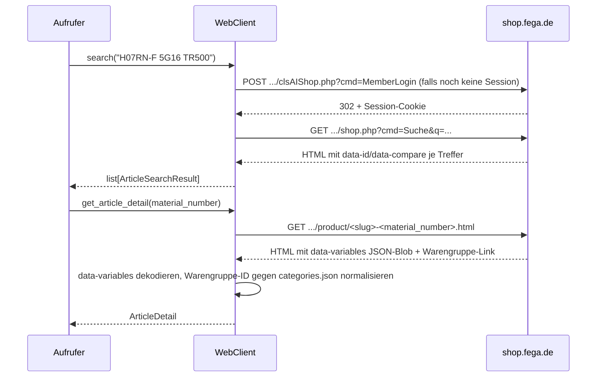

# Erweiterung: Zugriff auf den Webshop (Bilder, Herstellerteilenummer-/EAN-/Freitextsuche)

> **Status: Entwurf, zweifach empirisch gegenprüft, aber noch nicht implementiert.** Dieses Dokument beschreibt eine mögliche spätere Erweiterung, analog zu Abschnitt 7 in [architecture.md](architecture.md) (dort für IDS/UGL4/DATANORM). Es gibt noch keinen Code dazu, aber die technischen Kernannahmen wurden in zwei unabhängigen Sitzungen mit echten, gültigen Zugangsdaten gegen `https://shop.fega.de` verifiziert: einer Erstrecherche am 10.08.2026 (Abschnitt 2) und einem produktiven Testlauf über 72 reale Artikel am 10./11.08.2026 im Rahmen eines Warenwirtschafts-Kategorisierungs-Anwendungsfalls (Abschnitt 3), dessen Erkenntnisse hier eingearbeitet sind. Dieses Dokument ersetzt den früheren separaten Praxisbericht — beide Recherchestränge sind jetzt hier konsolidiert.

## 1. Motivation: Warum reicht SOAP/IDS nicht?

Keine der in [architecture.md](architecture.md) beschriebenen Schnittstellen liefert das, was hier gebraucht wird:

- **SOAP Preis-/Verfügbarkeitsservice** kennt ausschließlich die FEGA & Schmitt-eigene `MATERIAL_NUMBER` als Eingabe (siehe [models.py](../src/fega_schmitt_client/models.py)) und liefert Preis/Verfügbarkeit zurück — keine Bilder, keine Suche nach Herstellerteilenummer oder EAN, keine Freitextsuche, keine Kategorie-/Warengruppenzuordnung.
- **IDS-Artikelsuche** wäre vom Funktionsumfang her am nächsten dran, ist aber laut Architektur bewusst nicht umgesetzt: Sie ist als Browser-Blackbox spezifiziert, in der der *Nutzer* manuell weiterarbeitet — kein strukturierter Rückgabewert.
- Bilder und Kategoriezuordnung existieren überhaupt nur im Shop-Frontend, nicht in einer Batch-/SOAP-Nachricht.

Ziel: das Shop-Frontend als Datenquelle nutzen, dort wo es die einzige Quelle ist — Suche nach **Herstellerteilenummer**, **EAN**, **Freitext** (Ergebnisliste), **Kategorie-/Warengruppenzuordnung**, sowie **Bild-Extraktion** zu einem gefundenen Artikel.

## 2. Recherche-Ergebnisse

### 2.1 Kein SPA-Frontend — klassisches serverseitiges Rendering

Login-Formular, Suchergebnisseite, Artikeldetailseite und Kategorielisten sind vollständig serverseitig gerendertes HTML. Kein React/Vue/Angular, kein `id="root"`/`id="app"`-Shell-Pattern, keine der üblichen SPA-Marker im Markup. **Playwright ist damit für die Kernfunktionen nicht nötig** — ein einfacher HTTP-Client reicht, dieselbe Technik wie beim bestehenden SOAP-Client (`httpx`, bereits Kern-Dependency, siehe [pyproject.toml](../pyproject.toml)). Über zwei unabhängige Sitzungen an zwei verschiedenen Tagen und insgesamt weit über 200 Requests (Erstrecherche + 72-Artikel-Lauf + erneute Verifikation) traten **keine** Bot-Erkennungs-/CAPTCHA-/Rate-Limiting-Auffälligkeiten auf, bei durchgehend 0,2–0,3 s Pause zwischen Requests. Kein Hinweis, dass mehr Vorsicht nötig wäre — aber auch kein Test mit höherer Parallelität oder ganz ohne Pause.

### 2.2 Login

```http
POST https://shop.fega.de/scripts/clsAIShop.php?cmd=MemberLogin
Content-Type: application/x-www-form-urlencoded

memb_login=<Kundennummer>&memb_pass=<Shop-Kennwort>&winwidth=&winheight=&setcookie=1
```

→ `302 Found` mit `Location: .../shop.php?cmd=Startseite` und einem Session-Cookie (`sfs`, `HttpOnly`). Dieselben Zugangsdaten wie beim SOAP-Service (Kundennummer/Shop-Kennwort) funktionieren. Das Cookie ist auffällig auf mehrere einzelne Pfade gescoped (`/scripts/`, `/shop.php`, `/product/`, `/community/portal.php`, `/abtest/scripts/`, …) statt global auf `/`. In drei unabhängigen Logins (zwei eigene, einer aus dem 72-Artikel-Lauf) wurden nur `sfs`, `SERVERID`, `cookiesession1`, `cookieG` gesetzt — kein `PHPSESSID`. Ein echter Browser-Mitschnitt (siehe 2.8) zeigt aber, dass `PHPSESSID` sowie weitere Cookies (`sfs3`–`sfs5`, `kdb`, `fegalogon`) durchaus existieren — vermutlich akkumulieren sie sich erst über normale Navigation/AJAX-Nutzung, die ein reiner `curl`-Login nicht auslöst.

**A/B-Test-Pfad — bestätigt stabil:** Der Redirect nach dem Login landet unter `/abtest/scripts/shop.php?cmd=Startseite` statt `/scripts/shop.php?cmd=Startseite`. Über beide Recherchetage hinweg (10. und 11.08.2026) durchgehend reproduzierbar, auch bei direktem Aufruf von `/abtest/scripts/shop.php?cmd=Suche&q=...` mit der Login-Session, ganz ohne den Zwischenschritt über `Startseite`. Ob der Pfad kundenspezifisch oder zeitlich befristet ist, bleibt offen (siehe Abschnitt 5) — aber für eine Implementierung ist er inzwischen verlässlich genug, um hartkodiert zu werden, mit einem Fallback-Test beim ersten Aufruf.

### 2.3 Suche

```http
GET https://shop.fega.de/abtest/scripts/shop.php?cmd=Suche&q=<Suchbegriff>
```

**Bestätigt: ein gemeinsames Suchfeld für Artikelnummer, EAN, Herstellerteilenummer und Freitext.** Getestet und erfolgreich für:

- FEGA-Artikelnummer (`121350`, `051430`)
- EAN (`4016705110575` → findet Artikel `051430`)
- Herstellerteilenummer, kompakt (`05101057` → findet Artikel `051430`)
- Herstellerteilenummer, als Freitext mit Leerzeichen (`H07RN-F 5G16 TR500` → findet Artikel `121350`)
- Freitext-Beschreibung (`Aderendhülsen`)

Damit ist die im ursprünglichen Entwurf offene Frage "matcht `q` auch Herstellerteilenummer/EAN?" geklärt: ja, ein einziges Feld deckt alle vier Fälle ab.

Jeder Treffer steckt in einem `<div>` mit direkt auswertbaren Attributen — kein Bedarf, sich durch verschachteltes Markup zu hangeln:

```html
<div data-id="121350"
     data-compare="121350;NEUT Gummischlauchleitung H07RN-F 5G16 TR500m schwarz;https://shop.fega.de/media/PIM-Media-Small/12/1213/12135/121350.jpg"
     class="fsProductList__item ...">
  ...
  <a href="https://shop.fega.de/product/Kabel-Leitungen--Gummischlauchleitung-H07RN-F-5G16-TR500m-schwarz---121350.html">
    
  </a>
</div>
```

`data-compare` ist ein einfaches `;`-getrenntes Mikroformat: `material_number;description;thumbnail_url`. Zusammen mit dem `href` auf die Artikeldetailseite lässt sich eine Trefferliste allein aus diesen zwei Attributen aufbauen. Alternativ (im 72-Artikel-Lauf verwendet, ebenso robust): den ersten `/product/....html`-Link ziehen, der die gesuchte Artikelnummer im Slug enthält, per Regex `https://shop\.fega\.de/product/[^"']*<Nummer>\.html` — deckte 72/72 Fälle ab, mit Fallback auf den allerersten `/product/....html`-Link, falls die Nummer nicht im Slug auftaucht (kam nicht vor).

Herstellerteilenummer, EAN, Kategorie tauchen in der Trefferliste selbst **nicht** auf — dafür ist ein Folge-Request auf die Detailseite nötig (Abschnitt 2.4/2.5).

**Wichtig:** In der Trefferliste tauchen auch Fremdinhalte auf (Community-/Blog-Werbekacheln, Klasse `fsSucheWerbung`, Ziel `community/portal.php`) — diese haben zufällig ebenfalls ein `cmd=detail/<id>&artnr=<matnr>`-Linkmuster, führen aber zu einer Blog-Seite, nicht zur Artikeldetailseite. Ein Parser muss echte Produktkacheln (`fsProductList__item` mit `data-id`) von Werbekacheln (`fsSucheWerbung`) unterscheiden.

### 2.4 Artikeldetailseite: Herstellerdaten, EAN, Bild

```http
GET https://shop.fega.de/product/<slug>-<material_number>.html
```

Eine stabile, sprechende URL (z. B. `.../product/PROTEC-class--05101057--Aderendh%C3%BClsen-10-0qmm-12mm-PAEH-1000-12-rot-isoliert-VE100---051430.html`), aus der Trefferliste direkt per `href` erreichbar.

**Herstellerdaten/EAN** stecken in einem `data-variables="{...}"`-Attribut mit einem vollständigen, HTML-entity-kodierten JSON-Blob (Klasse `fsOxomi` — vermutlich Anbindung an **Oxomi**, siehe Abschnitt 6). **Korrektur (11.08.2026):** Das sitzt entgegen der ursprünglichen Annahme nicht auf einem eigenen `<div>`, sondern direkt auf dem `<body>`-Tag der Artikeldetailseite selbst — der Parser-Regex war davon nie betroffen (er verankert nur an `data-variables="..." class="fscomponent fsWebsite`, unabhängig vom Tag-Namen), aber die Doku-Beschreibung war falsch. Praktisch relevant wird das erst in Abschnitt 2.9: derselbe JSON-Blob trägt zusätzlich ein `"variants"`-Array mit der vollständigen Attribut-Varianten-Matrix. Relevante Felder, am Beispiel zweier getesteter Artikel:

| Feld | Artikel 121350 (Kabel, Meterware) | Artikel 051430 (Aderendhülse) |
| --- | --- | --- |
| `oxom_arnr` | `"121350"` | `"051430"` |
| `oxom_ean` | `""` (leer) | `"4016705110575"` |
| `supplierName` | `"Kabel / Leitungen"` | `"PROTEC.class"` |
| `supplierItemNumber` | `"H07RN-F 5G16 TR500"` | `"05101057"` |
| `supplierItemNumber3` | `null` | `"PAEH 1000/12"` |
| `supplierNumber` | `"80003"` | `"79559"` |

**Aber:** `supplierName` ist bei Artikel 121350 offensichtlich kein Herstellername, sondern eine interne Warengruppenbezeichnung ("Kabel / Leitungen") — bei Artikel 051430 dagegen tatsächlich die Marke ("PROTEC.class"). Die Feldsemantik ist also **nicht durchgängig konsistent** und mit nur zwei Stichproben nicht abschließend zu klären (siehe Abschnitt 5). `supplierItemNumber` scheint verlässlicher die Herstellerteilenummer zu sein.

**Bild — einfacher als über `data-variables`:** Ein direkter Tag-Match reicht, kein JSON-Decoding nötig:

```python
re.search(r'`-Struktur. Im 72-Artikel-Lauf lieferte dieser einfache Regex-Match 72/72 Treffer, ganz ohne den `data-variables`-Blob zu parsen — für reine Bild-Extraktion also der einfachere Weg; der JSON-Blob bleibt nötig für Hersteller/EAN.

Bilder sind **ohne Login** abrufbar (verifiziert per `curl` ohne Cookie, `200 image/jpeg`) — nur Login/Preise/Suche/Kategorielisten brauchen die Session. `HEAD`-Requests auf `/media/PIM-Media-Big/...` liefern `500 Internal Server Error` (kein `HEAD`-Support auf diesem Pfad) — für Existenz-/Größenchecks immer `GET` verwenden.

Bilder werden häufig **pro Artikelfamilie geteilt**, nicht 1:1 pro `MATERIAL_NUMBER` — bestätigt und deutlich häufiger als in der Erstrecherche vermutet: identische Bilder bei allen SKUs einer Variantenfamilie (Farben/Querschnitte/Baugrößen), beobachtet u. a. bei einer 3er- und mehreren 4er/8er-Gruppen unterschiedlicher Hersteller. Für einen Bild-Cache/Katalogabgleich ist das die Regel bei Farben-/Größenvarianten, kein Bug.

### 2.5 Warengruppe (Kategorie) einer Artikeldetailseite

Steht **zweimal** im sichtbaren HTML, nicht im `data-variables`-Blob — beide Stellen verlinken auf dieselbe `cmd=Hierarchie/<UWG-ID>`-URL:

```html
<!-- Variante 1: oberer Info-Block -->
<span class="fsProductInfo__label">Warengruppe</span>
<span class="fsProductInfo__text">
    <a class="fsLink fsLink--text" href="https://shop.fega.de/abtest/scripts/shop.php?bold=&amp;cmd=Hierarchie/UWG_14_87_0&amp;mode=list">
        Verdrahtungsmaterial
    </a>
</span>

<!-- Variante 2: unterer Übersichtsblock (kein href, nur Text) -->
<div class="fsProductOverview__label">Warengruppe:</div>
<div class="fsProductOverview__value">
    <a class="fsLink fsLink--text" href="#">Verdrahtungsmaterial</a>
</div>
```

Extraktion, verankert am sichtbaren `Warengruppe`-Label (**nicht** bloß nach `cmd=Hierarchie/` suchen — das matcht sonst zuerst einen generischen Navigationslink `cmd=Hierarchie/UWG&mode=showKata` "zum Gesamtkatalog", der auf jeder Detailseite vor dem eigentlichen Warengruppen-Link steht):

```python
m = re.search(
    r'Warengruppe\s*</span>\s*<span class="fsProductInfo__text">\s*'
    r'<a[^>]*href="[^"]*cmd=Hierarchie/([A-Za-z0-9_]+)[^"]*"[^>]*>\s*([^<]+)',
    html,
)
wg_id, wg_name = m.group(1), m.group(2).strip()   # z.B. "UWG_14_87_0", "Verdrahtungsmaterial"
```

**Suffix stimmt nicht 1:1 mit dem in [fega_categories.md](fega_categories.md) extrahierten Baum:** Die auf der Detailseite verlinkte ID trägt ein zusätzliches Segment gegenüber der Baum-ID, z. B. `UWG_14_87_0` auf der Seite vs. `UWG_14_87` im Baum, oder `UWG_1_1_0` vs. `UWG_1_1` (am 11.08.2026 erneut mit einem zweiten Artikel bestätigt — beide Male hängt an einer *Blatt*-Kategorie des Baums ein zusätzliches `_0`). Bei manchen Kategorien ist ein Suffix-Segment dagegen ein "echtes" zusätzliches Ebenen-Segment, das im Baum genauso existiert. Robuste Zuordnungsstrategie: erst exakte ID gegen den Baum matchen, bei Fehlschlag das letzte `_<Zahl>`-Segment abschneiden und erneut versuchen — deckte im 72-Artikel-Lauf 100 % der Fälle ab.

### 2.6 Artikelliste einer Kategorie (`mode=list`)

Neu verifiziert (11.08.2026): `cmd=Hierarchie/<id>&mode=list` (derselbe Link wie in Abschnitt 2.5, Variante 1) liefert eine Trefferliste im **gleichen Kachelformat wie die Suche** (Abschnitt 2.3, `data-id`/`class="fsProductList__item"`):

```http
GET https://shop.fega.de/abtest/scripts/shop.php?bold=&cmd=Hierarchie/UWG_1_1&mode=list
```

lieferte für die Kategorie "Aderendhülsen" (`UWG_1_1`) zehn eindeutige Artikel-IDs (mehrfach im DOM, vermutlich Grid-/List-Ansicht parallel gerendert — wie schon bei den Suchergebnissen in 2.3). Eine spätere `list_articles_by_category(uwg_id)`-Methode könnte denselben Tile-Parser wie `search()` wiederverwenden. **Offen:** Ob/wie Paginierung funktioniert (kein Hinweis auf Gesamttrefferzahl/Seiten im HTML gefunden) und ob zehn Treffer die vollständige Kategorie oder nur eine erste Seite sind — nicht weiter untersucht.

### 2.7 Konto-Funktionen: Warenkorb, Bestellungen, Favoriten, Aktionsangebote

Zusätzlich zu Suche/Kategorie/Bild (Abschnitte 2.3–2.6) wurde am 11.08.2026 der eingeloggte Kontobereich stichprobenartig untersucht, da mehrere weitere Funktionen (eigene Warenkörbe, Bestellhistorie, Favoriten, Aktionsangebote, eigene Artikelnummer) für eine Erweiterung gewünscht sind. Alle Fundstellen unten sind **strukturell bestätigt** (echte Antwort mit sinnvollem Inhalt erhalten), aber deutlich weniger tief geprüft als Suche/Artikeldetail — insbesondere Feldnamen/Paginierung nicht vollständig kartiert. Konkrete reale Werte (Warenkorbnamen, Bestellnummern, Artikel in Favoriten) sind hier bewusst nicht wiedergegeben, da es sich um echte Kundendaten des Testaccounts handelt.

**Warenkorb** — `cmd=BasketView` (aktueller Warenkorb) bzw. `cmd=BasketView/<id>` (spezifischer, benannter Warenkorb; `id` numerisch). Der Shop unterstützt **mehrere benannte Warenkörbe parallel**: Ein `<select name="sel_wk">` auf der Warenkorbseite listet die übrigen Warenkörbe als `<option value="<id>"><Name></option>` — das ist vermutlich die Datenquelle für `get_cart_list()`, eine dedizierte Listen-Route wurde nicht gefunden. Weitere Aktionen: `cmd=BasketView/<id>&mode=changeName` (umbenennen), `cmd=BasketView/&mode=newWK` (neu anlegen), `cmd=DeleteBaskets` (löschen). Jede Position im Warenkorb trägt `data-wk-pos` (Positionsindex), `data-pwahl_id`/`data-pwahl_provar_id` (interne Positions-/Variantenkennung), eine editierbare Menge, ein Kommentarfeld und eine "Kommission"-Zuordnung (Projekt-/Auftragsreferenz, B2B-üblich).

**Bestellungen/Aufträge** — `cmd=Auftraege` (Liste, div. `mode=`-Varianten, u. a. `opbauDok` für den im Menü verlinkten Reiter "Bestellungen > Aufträge") liefert eine Tabelle mit einer Zeile je Auftrag/Position (`data-id="<Auftragsnummer>_<Position>"`). Einzelabruf: `cmd=Auftraege/<Auftragsnummer>&mode=detail&show_complete=1`. Positionsdetails teils lazy nachgeladen (`data-loaded="false"` auf einer `positions_table`) — für einen vollständigen Abruf ggf. ein Folge-Request auf `cmd=Auftraege/<Auftragsnummer>_<Position>&mode=pos&active_line=<n>` nötig, nicht abschließend geklärt.

**Favoriten** — `cmd=Favorites/-1` (Bedeutung des `-1`-Suffix ungeklärt, evtl. "Standardliste"/"alle Listen"). Liefert Trefferkacheln im **exakt gleichen Format** wie die Suche (`data-compare`/`class="fsProductList__item"`, siehe 2.3) — `get_favorite_list()` kann denselben Tile-Parser wie `search()` wiederverwenden, keine separate Parsing-Logik nötig.

**Aktionsangebote — zweistufig, nicht direkt:** `cmd=Deal` (ohne ID) listet **Kampagnen** (`fsDealKachel`-Kacheln, z. B. "Sonderabverkauf Licht", "PROTEC.class Einführungsaktion" — je Kachel eine `data-id` als Kampagnen-ID plus Titel in einem `<h4>`), **keine Artikel**. Erst `cmd=Deal/<Kampagnen-ID>&mode=1` liefert die Artikel der Kampagne im bekannten `data-compare`-Format — derselbe Endpunkt-Typ, der weiter unten für "2. Wahl" verwendet wird. Das wurde erst beim Implementieren gegen einen echten `cmd=Deal`-Snapshot bemerkt (eine erste Annahme, `cmd=Deal` liefere direkt Artikel, war falsch, siehe Bekannte-Lücken-Historie in [PLANNED_FEATURES.md](../PLANNED_FEATURES.md)). `cmd=TagA` ("Tagesangebote"/"Meine Tagesangebote") lieferte am Test-Tag **keine** Treffer — vermutlich ein leerer, aber funktionierender Zustand; ob es dieselbe zweistufige Struktur (Kampagnen → Artikel) oder direkt Artikel-Tiles verwendet, ist mangels eines nicht-leeren Beispiels ungeklärt. `cmd=Objekte` ("Objektangebote") ist ein weiterer, thematisch verwandter, aber nicht inspizierter Endpunkt.

**Eigene Artikelnummer (Kundenartikelnummer)** — Lesen jetzt vollständig bestätigt, Schreiben weiterhin offen. Die Checkbox `name="nshow_kuar"` unter `cmd=Einst` ("Meine Artikelnummer anzeigen") steuert nur die **Anzeige**. Das eigentliche Feld sitzt direkt auf der Artikeldetailseite (in beiden Layout-Varianten, Desktop und Mobile) und wurde an einem real vom Nutzer gepflegten Beispiel verifiziert (Artikel `253439`, eigene Nummer `BUSCH-JALOUSIE-UP`):

```html
<span class="fsProductInfo__label">Meine Artikelnummer</span>
<input class="fsProductInfo__input" type="text" name="ownArticleNumber" data-orgarnr="253439" value="BUSCH-JALOUSIE-UP">
<button class="fsProductInfo__submit fscomponent fsOwnArticleNumber" type="button">…</button>
```

`get_article_number(material_number)` ist damit trivial: einfach `ownArticleNumber`/`value` vom selben Detailseiten-Request abgreifen, den `get_article_detail` ohnehin schon lädt — kein zusätzlicher Request nötig, ein zusätzliches Feld auf `ArticleDetail` reicht. In der Trefferliste der Suche taucht der Wert **nicht** auf (`data-compare` unverändert, nur `material_number;description;thumbnail_url`).

`set_article_number` bleibt offen: Der Speichern-Button ist `type="button"` (kein `<form action="...">` drumherum, kein Submit) — das Schreiben läuft rein über JavaScript/AJAX, dessen Ziel-Endpoint sich aus dem statischen HTML nicht ableiten lässt. Wie bei den formalen Preisangeboten (siehe unten) wäre ein Netzwerk-Mitschnitt beim tatsächlichen Klick auf "Speichern" im Browser der nächste Schritt.

**2. Wahl / B-Ware — bestätigt** (per echtem Browser-Link, nicht durch eigenes Erraten gefunden):

```http
GET https://shop.fega.de/abtest/scripts/shop.php?bold=&cmd=Deal/3342&mode=1&svc=2Wahl
```

`3342` ist die (offenbar feste) Kampagnen-/Deal-ID für den 2.-Wahl-Bereich, `svc=2Wahl` ein zugehöriger Pflichtparameter. Liefert Trefferkacheln im vertrauten Mikroformat, nur mit eigener CSS-Klasse `fsDealList__item` statt `fsProductList__item`:

```html
<div data-compare="9801856;2-WAHL BEGA LED-Pendelleuchte 50401.1K4 4000K T3 (50401.1K4KW092025);https://shop.fega.de/media/PIM-Media-Small/98/9801/98018/9801856.jpg"
     data-id="9801856" class="fsDealList__item resizeTile">
```

Artikeldetail-URLs folgen dem bekannten `/product/<slug>-<material_number>.html`-Schema (z. B. `.../product/BEGA--50401-1K4KW092025--2-WAHL-BEGA-LED-Pendelleuchte-50401-1K4-4000K-T3---9801856.html`) — `get_article_detail`/`get_article_images` funktionieren also unverändert auch für B-Ware-Artikel. Der Einstiegspunkt im UI selbst wurde nicht über die Hauptnavigation gefunden, sondern über einzelne 2-Wahl-Artikel in einem Aktions-Widget auf der Startseite, die auf ihre eigene Detailseite verlinken; von dort (bzw. aus einem "alle anzeigen"-Link, nicht selbst nachvollzogen) führt der Weg zur obigen Kampagnenseite.

**Wichtiger Fallstrick, an diesem Endpunkt entdeckt:** Der `bold=`-Parameter verhält sich wie ein **sitzungsgebundenes Token**, kein beliebig gebrauchter Query-Parameter. Ein aus einem echten Browser kopierter Link mit `bold=5` löste in einer separaten `curl`-Sitzung (gültiger Login, aber anderer `bold`-Zustand) `Bitte melden Sie sich neu an.` aus — trotz gültiger Session (derselbe Effekt wie bei einem beliebig gewählten `bold=2` in einer früheren Stichprobe, siehe Abschnitt 2.2 der Erstrecherche). Mit `bold=` (leer) funktionierte derselbe Endpunkt sofort. **Mechanismus inzwischen geklärt** (siehe AJAX-Mitschnitt in 2.8): Der Shop führt serverseitig ein Cookie `cbold` (z. B. `cbold=5`), und `bold=` im Request muss zu diesem Cookie-Wert passen — ein reiner Session-Zähler/Nonce, keine feste Konstante. **Konsequenz:** In einer Implementierung `bold` immer leer lassen (funktionierte für alle bisher getesteten GET-Endpunkte), niemals einen aus einer Beispielsitzung kopierten Wert hartkodieren. Für Schreib-Endpunkte (siehe 2.8) ist noch offen, ob `bold=` leer ebenfalls reicht oder ob der aktuelle `cbold`-Cookie-Wert aktiv gespiegelt werden muss.

### 2.8 Eigene Artikelnummer setzen (`AjaxArticleNumber`) — per Netzwerk-Mitschnitt bestätigt

Am 11.08.2026 vom Nutzer per Browser-DevTools mitgeschnitten (echte Aktion: eigene Artikelnummer für Artikel `253439` gesetzt):

```http
POST https://shop.fega.de/abtest/scripts/shop.php?bold=<cbold-Cookie-Wert>&cmd=AjaxArticleNumber
Content-Type: application/x-www-form-urlencoded; charset=UTF-8
X-Requested-With: XMLHttpRequest
Referer: https://shop.fega.de/product/<slug>-<material_number>.html

ownArticleNumber=<eigene Nummer>&arnr=<material_number>
```

Damit ist `set_article_number(material_number, own_number)` vollständig spezifiziert. Wichtige Implementierungsdetails aus dem Mitschnitt:

- **`X-Requested-With: XMLHttpRequest` und ein passender `Referer`** sind gesetzt — typisch für serverseitige AJAX-/CSRF-Erkennung. Ob beide zwingend erforderlich sind oder der Server nur `X-Requested-With` prüft, wurde nicht getestet; sicherheitshalber beide mitschicken.
- **`bold=`/`cbold`-Kopplung**: Der Mitschnitt bestätigt den in Abschnitt 2.7 vermuteten Mechanismus direkt — die Cookies enthalten `cbold=5`, die URL `bold=5`, exakt übereinstimmend.
- **Mehr Cookies als beim reinen Login beobachtet**: Der echte Browser schickt neben `sfs` zusätzlich `sfs3`, `sfs4`, `sfs5`, `PHPSESSID`, `kdb` und ein Langzeit-Login-Token `fegalogon` mit — keines davon tauchte nach einem reinen `MemberLogin`-POST in dieser Recherche auf (siehe 2.2). Vermutlich akkumulieren sich diese über normale Navigation/AJAX-Aufrufe im Browser, die eine einzelne `curl`-Login-Session nicht auslöst. Für `httpx.Client` bedeutet das: die Cookie-Handling-Verifikation aus Abschnitt 4 muss auch prüfen, ob `AjaxArticleNumber` (und andere Schreib-Endpunkte) mit *nur* den nach dem Login gesetzten Cookies funktionieren, oder ob zusätzliche Requests nötig sind, um diese weiteren Cookies zu erhalten.
- **`PHPSESSID` existiert also doch** — löst die in Abschnitt 2.2 vermerkte Unstimmigkeit auf (in reinen `curl`-Login-Sessions dieser Recherche nie beobachtet, im echten Browser aber vorhanden).

**Weiterhin nicht gefunden:** Formale Angebote/Preisangebote (Kundenangebote/Quotes im B2B-Sinn, nicht Aktionsangebote). Der Navigationspunkt "Angebote" im Shop-Header ist ein reiner JS-Trigger (`fsTriggerMeinOnlineshop`, `data-search-term="Angebote"`) ohne direkten `href` — öffnet vermutlich ein per AJAX nachgeladenes Panel ("Mein Onlineshop"), dessen tatsächlicher `cmd=`-Endpunkt sich ohne Ausführen des zugehörigen JavaScript nicht ermitteln ließ. Mehrere naheliegende `cmd=`-Namen (`Angebote`, `MeineAngebote`, `Quotes`, `Preisangebote`) wurden direkt getestet, alle lieferten `200` mit leerem Inhalt (0 Byte). Nächster Schritt: wie beim B-Ware-Fund oben ein echter, im Browser beobachteter Link — eigenes Erraten von `cmd=`-Namen war für B-Ware erfolglos und lieferte erst nach einem konkreten Link-Fund ein Ergebnis.

### 2.9 Produktdetails, Zubehör, Varianten, Alternativen, Dokumente

Live gegen drei reale Artikeldetailseiten (`253439`, `121350`, `051430`) verifiziert am 11.08.2026, jeweils per `WebClient`-Methode end-to-end bestätigt (nicht nur strukturell aus dem HTML abgeleitet):

**Produktdetails/Attribute** — der Bereich "Produktdetails" auf der Artikeldetailseite (`fsProductOverview__grid`) enthält kategorie-/artikeltyp-spezifische Attribut-Paare, verankert an `<span class="fsProductOverview__label alternativesLabelContainer">Label:</span>` gefolgt von `<div class="fsProductOverview__value">Wert</div>`. Feldnamen variieren stark je Warengruppe (z. B. "Farbe"/"Werkstoff" bei Aderendhülsen, "Nennspannung"/"Bemessungsstrom" bei einem Schalter, "Leiternennquerschnitt"/"Ader-Zahl" bei einem Kabel) — daher `dict[str, str]` statt fester Felder. Zu unterscheiden von den fixen `fsProductOverview__item--mobile`-Feldern "Artikelnummer"/"Meine Artikelnummer" (bereits über `parse_article_detail()` abgedeckt), die eine andere, nicht `alternativesLabelContainer`-klassifizierte Markup-Variante nutzen und deshalb nicht doppelt auftauchen.

**Zubehör, "Oft zusammengekauft mit", Varianten, Alternativen** — alle vier folgen demselben Muster: ein `<h2 class="fsProductTeaser__headline">`-Abschnitt mit einem "Jetzt vergleichen"-Button (Klasse `fsWand`), dessen `data-compare`-Attribut eine flache, kommagetrennte Liste von Artikelnummern ist — die eigene Artikelnummer immer zuerst, danach die verwandten Artikel:

```html
data-compare="051430,051988,057288,053943"   <!-- Zubehör -->
data-compare="051430,054821,051870,...,051878"  <!-- Varianten, 12 Einträge -->
data-compare="051430,6169773,9641674,215128,935733,378316"  <!-- Alternativen -->
```

Kein Bedarf, einzelne Kacheln zu parsen — die vollständige Artikelnummernliste steht bereits im `fsWand`-Button. Anker ist der sichtbare Überschriftentext (`Zubehör`/`Varianten`/`Alternativen`/`Oft zusammengekauft mit`), nicht die numerische Abschnitts-ID (`productTeaser1`/`2`/`3`, `productCompare`) — letztere war zwar in allen drei getesteten Fällen stabil zugeordnet, aber ein Abschnitt kann bei einem Artikel komplett fehlen (bei `253439` z. B. kein `productCompare`/Alternativen-Block überhaupt), was die ID-Reihenfolge verschieben könnte.

**Wichtiger Fallstrick, hier entdeckt:** Der separate Button "Verwandte Artikel anzeigen" (`fsProductOverview__findAlternatives`, `data-arnr="..."`) sieht wie der Alternativen-Einstieg aus, ist aber eine **andere**, rein JS-getriebene Funktion (attributbasierte Ähnlichkeitssuche über Checkboxen `fsShowVerwandteArtikelButton` neben den Produktdetails-Attributen) — bei allen drei getesteten Artikeln `hidden disabled`. Die tatsächlichen "Alternativen" stehen unabhängig davon bereits statisch im `productCompare`-Abschnitt (falls vorhanden). `get_article_alternatives()` nutzt nur Letzteres; der JS-Finder wird nicht angesteuert.

**"Oft zusammengekauft mit"** war nicht ursprünglich geplant, ergab sich aber kostenlos aus demselben Muster (`get_article_cross_sell()`).

**Vollständigkeit/Paginierung ungeklärt:** Varianten/Alternativen/Cross-Sell-Abschnitte haben zusätzlich einen "Alle anzeigen"-Link (`cmd=ShowAll/<matnr>&mode=var|alter|cross`), Zubehör nicht. Ob die inline `data-compare`-Liste bei sehr vielen verwandten Artikeln gekappt wird (beobachtete Maximalwerte lagen bei 12–13 Einträgen, könnte Zufall oder ein Anzeige-Limit sein) und `ShowAll` dann die vollständige Liste liefert, wurde nicht getestet.

**Dokumente — nicht implementiert, Endpunkt nicht funktionsfähig reproduzierbar:** Der Dokumente-Bereich (`fsProductBarDokumente`, Button "Technische & regulatorische Dokumente") zeigt strukturell auf `cmd=AjaxDetailDocs&art=detail&title=technik&krnr=<Lieferantennummer>` mit einem zusätzlichen `data-json-wert` (eine doppelt kodierte JSON-Map von Dokumenttyp-ID auf Artikelnummer, z. B. `{"6":"253439","7":"253439",...}`). Mehrere plausible Aufrufvarianten wurden getestet (GET/POST, `wert`/`json-wert` als Body/Query-Parameter, mit/ohne `X-Requested-With`, mit/ohne passendem `Referer`, `bold=` leer und `bold=cbold`) — alle lieferten `200` mit leerem Body (0 Byte), keine 500-Fehler wie bei Varianten (siehe unten), aber auch kein Inhalt. Nicht klar, ob das an falschen Parametern liegt oder die drei Testartikel schlicht keine hinterlegten Dokumente haben. Wie beim Angebote-Endpunkt (2.8): nächster Schritt ist ein echter Browser-Mitschnitt, kein weiteres Raten von Parameternamen.

**Varianten-Detailauflösung (`AjaxVarianten`) — durch einen späteren Fund (siehe unten) gegenstandslos geworden:** Über die einfache `data-compare`-Liste hinaus gibt es einen komplexeren EAV-Variantenwähler (Radiobuttons je Attribut, z. B. "Farbe"/"Hülsenlänge"/"Nennquerschnitt" mit `data-etim`/`data-val1`-Attributen), dessen Formular auf `cmd=AjaxVarianten&mode=getVariants&arnr=<matnr>&variant=<Gruppen-ID>` zeigt. Alle getesteten Aufrufvarianten (GET/POST, mit vollständigem Satz der aktuell ausgewählten Attributwerte als Zusatzparameter, mit/ohne AJAX-Header) lieferten durchgängig `HTTP 500`. Nicht weiter verfolgt, weil sich die eigentlich benötigten Daten (siehe "Vollständige Varianten-Matrix" unten) als bereits im Seiten-HTML vorhanden herausstellten, ganz ohne diesen Endpunkt.

**Vollständige Varianten-Matrix — Nachtrag vom 11.08.2026, ersetzt die `data-compare`-Liste als Datenquelle für `get_article_variants()`:** Der Nutzer wies auf ein Artikelbeispiel hin (Leitungsschutzschalter, Artikelnummer `125406`), dessen Shop-UI eine deutlich größere, klickbare Variantenauswahl zeigt als die 12–13 Einträge, die die `data-compare`-Liste bisher lieferte. Auf Vorschlag des Nutzers wurde das per **Playwright** untersucht (siehe auch Abschnitt 11: bislang als reine Eskalationsstufe dokumentiert, hier erstmals tatsächlich für eine Recherche eingesetzt, nicht für die Library selbst):

- Im **Headless**-Modus blockierte der Server die Anfrage vollständig (`The URL you requested has been blocked`, HTTP 500) — der reine `httpx`-Zugriff war zu keinem Zeitpunkt betroffen, das ist also eine Headless-Browser-spezifische Erkennung, kein genereller Block. Im **headed** Modus (echtes Display, vom Nutzer vorgeschlagen) lud die Seite normal.
- Beim Vergleich der geladenen Seite fiel auf, dass der bereits bekannte `data-variables`-JSON-Blob (siehe Abschnitt 2.4 — Korrektur dort: sitzt auf `<body>`, nicht auf einem eigenen `<div>`) zusätzlich ein `"variants"`-Array trägt, das dieselben Daten enthält wie die klickbare Auswahl im Browser. **Das ist derselbe Blob, kein zweiter** — bereits vollständig im ganz normal per `httpx` abgerufenen HTML enthalten, keine Playwright/AJAX-Abhängigkeit für die Daten selbst.
- Struktur je Eintrag: `{"anz": "2", "arnrlist": "365065,9556016", "values": {"EF000227": {"val1": "20", ...}, ...}}` — `arnrlist` eine oder mehrere Artikelnummern für exakt diese Attributkombination, `values` die Kombination selbst als EF/EV-Codes (dieselben Codes wie in den Radiobuttons des `AjaxVarianten`-Formulars oben). Die eigene Artikelnummer taucht in diesem Array nie auf (anders als bei der `data-compare`-Liste, wo sie als erster Eintrag steht und explizit entfernt wird).
- Umfang: bei `125406` **512** eindeutige Artikelnummern über die Kombination aus Bemessungsstrom (0,5–125 A), Auslösecharakteristik (B/C/D/K/Z) und Polzahl (1–4) — gegenüber 3 aus der alten `data-compare`-Liste für denselben Artikel. Bei allen 4 bisher getesteten Artikeln vorhanden (auch als leeres Array bei den beiden ohne echte Varianten).
- `get_article_variants()` nutzt jetzt diese Quelle, mit Fallback auf die alte Teaser-Extraktion, falls der JSON-Blob einmal fehlt/nicht parsbar ist. Die EF/EV-Codes selbst werden (noch) nicht in lesbare Attributnamen/-werte aufgelöst — das würde zusätzlich die Radiobutton-Labels aus dem `AjaxVarianten`-Formular auswerten, bewusst nicht umgesetzt (siehe [PLANNED_FEATURES.md](../PLANNED_FEATURES.md)).

**Architektur-Refactor (11.08.2026):** Ursprünglich holte und parste jede `get_article_*()`-Methode die Detailseite unabhängig (je zwei HTTP-Requests pro Methode, siehe search()+Detailseite in 2.4). Auf Wunsch des Nutzers gibt es jetzt einen zusammenfassenden Parser `_parse.parse_article()`, der aus einem einzigen HTML-Dokument einen vollständigen `Article`-Baum baut (alle Felder aus 2.4/2.5/2.7/2.9 plus `fetched_at`-Zeitstempel und ein bislang immer leeres `documents`-Feld als Platzhalter für den noch ungeklärten Dokumente-Endpunkt oben). `WebClient.get_article(material_number)` ist die neue primäre Methode dafür; `Article.to_dict()` liefert die JSON-Serialisierung (verschachteltes `category`-Objekt, ISO-8601-Zeitstempel, Bilder als Liste von `{"url", "is_primary"}`). Alle bisherigen `get_article_detail()`/`get_article_images()`/`get_article_attributes()`/`get_article_accessories()`/`get_article_variants()`/`get_article_alternatives()`/`get_article_cross_sell()`/`get_article_category()`/`get_article_number()` bleiben als dünne Wrapper auf `get_article()` erhalten (keine Breaking Changes an ihren Signaturen/Rückgabetypen) — sparen aber keine Requests gegenüber vorher, wenn man mehrere davon einzeln für denselben Artikel aufruft; dafür `get_article()` direkt verwenden und die Felder aus einem Ergebnis lesen.

### 2.10 Verfügbare Kabellängen (`AjaxKLaeng`) und Schnittkosten

Auf Wunsch des Nutzers untersucht (Beispielartikel: NYM-J 5x16 TR500m, `104260`), live end-to-end über `WebClient` bestätigt am 11.08.2026.

**`get_cable_lengths(material_number)`** — bei Kabeln, die von der Trommel verkauft werden, zeigt der Shop unter "verfügbare Kabellängen" eine Übersicht aller aktuell verfügbaren Trommeln/Reststücke je Lagerstandort. Endpunkt: `cmd=AjaxKLaeng/<material_number>` — anders als `get_article()` **ein einzelner Request**, da die Artikelnummer direkt im `cmd`-Pfad steht (kein vorheriger `search()`-Schritt zur Ermittlung der Slug-URL nötig, wie sonst für Artikeldetailseiten).

Struktur je Zeile (Desktop-Layout, `col-sm-*`-Klassen; ein inhaltsgleicher, aber unvollständigerer `col-xs-*`-Mobile-Block direkt darunter wird bewusst ignoriert, um Zeilen nicht doppelt zu zählen):

| Spalte | Bedeutung | Beispielwerte |
| --- | --- | --- |
| Verpackung | Trommeltyp | "KTG Trommel", "Einwegtrommel" |
| Länge | Bestellmodus | "zum Ablängen" (Reststück, beliebige Teillänge bestellbar) oder "fest" (nur die volle angegebene Menge) |
| Trommelgröße | nominale Trommellänge, falls angegeben | "500" bei runden Standard-VPE, leer bei Reststücken ohne runde Länge |
| Anzahl | Anzahl Trommeln mit exakt dieser Kombination | z. B. 1, 35 |
| insgesamt verfügbar | Gesamtmenge dieser Zeile in Metern | Anzahl × Trommelgröße bei runden VPE (z. B. 35×500=17500), sonst die Reststück-Länge direkt |

Mehrere Lagerstandorte (`Bestand Zentrallager`, `Bestand FEGA & Schmitt Erlangen`, …) nutzen identisches Zeilen-Markup — Zeilen werden daher am jeweils vorausgehenden `bg-blue20`-Standort-Header block-begrenzt zugeordnet (analog zum bereits bekannten Muster bei `parse_deal_campaigns()`), nicht global geparst. Validierung: Summe aller `total_available_m`-Werte im Testartikel ergab exakt 30316 — identisch mit der auf der Seite angezeigten Endsumme "Zentrallager insgesamt: 30316".

**`has_cable_lengths(material_number)`** — dünner Wrapper, `bool(get_cable_lengths(...))`.

**`get_cutting_fee(material_number)` / `Article.cutting_fee`** — der Hinweistext "Eventuell fallen Schnittkosten in Höhe von X an." sitzt auf der normalen Artikeldetailseite (nicht im `AjaxKLaeng`-Overlay), direkt neben dem Preis. Nur bei Kabelartikeln vorhanden (bei den bereits früher getesteten Nicht-Kabel-Artikeln 051430/253439 fehlt der Text komplett, ergibt `None`), daher als Feld auf `Article` mit über `parse_article()` befüllt statt als eigener Zwei-Request-Abruf.

## 3. Herkunft der Praxis-Erkenntnisse (Abschnitte 2.3–2.6)

Ein Teil der obigen Erkenntnisse (Warengruppen-Extraktion, einfache Bild-Extraktion, bestätigte EAN-/Herstellerteilenummer-Suche, Cookie-Fallstrick unten) stammt nicht aus der Erstrecherche, sondern aus einem **echten Produktiveinsatz**: ein downstream Warenwirtschafts-Abgleich (Kategorisierung eines bestehenden Teilebestands, 72 reale Artikel, verifiziert per Bash/curl-Skript mit eingebetteter Python-Regex-Extraktion, 0 Fehlschläge nach Fix des `Warengruppe`-Regex-Ankers). Das ist der wichtigste Beleg dafür, dass Kategorie- und Bild-Extraktion nicht nur theoretisch möglich sind, sondern einen validierten realen Bedarf abdecken — anders als Hersteller-/EAN-Suche, die bisher nur in dieser Recherche getestet wurde, ohne bekannten konkreten Abnehmer.

## 4. Ein konkreter Implementierungs-Fallstrick: Cookie-Datei-Roundtrip

Ein Versuch, von `curl -c cookies.txt` geschriebene Cookies in einer separaten Python-Session (`http.cookiejar.MozillaCookieJar(...).load()` + `urllib`) wiederzuverwenden, hat **stillschweigend** die Session-/Auth-Cookies (`sfs`) verworfen — nur `cookiesession1`, `SERVERID`, `cookieG` wurden tatsächlich mitgeschickt, die Seite kam unauthentifiziert zurück, ganz ohne Fehler oder Exception (nur an einer nicht mehr auf die erwartete Ergebnisseite passenden Antwort erkennbar). Ursache vermutlich Pfad-Matching-Eigenheiten von `http.cookiejar` bei mehreren `Set-Cookie`-Einträgen mit gleichem Namen, aber unterschiedlichem `path=` (der `sfs`-Cookie kommt laut Abschnitt 2.2 mehrfach mit verschiedenen Pfaden). `curl` mit demselben Cookie-File hat anstandslos funktioniert; dieselbe Situation trat unabhängig auch im 72-Artikel-Produktivlauf auf.

**Konsequenz für eine Implementierung:** Kein Cookie-Datei-Roundtrip zwischen Prozessen/Bibliotheken — einen einzigen, langlebigen `httpx.Client` für die gesamte Sitzung verwenden (siehe Abschnitt 8). **Wichtig:** `httpx` hat eine eigene, von `http.cookiejar` unabhängige Cookie-Implementierung — der beobachtete Bug ist kein Beweis, dass `httpx.Client` dasselbe Problem hat, aber auch kein Beweis, dass es *nicht* auftritt. Vor einer Implementierung explizit mit `httpx.Client` gegen den mehrfachen `sfs`-Pfad-Cookie testen, nicht einfach annehmen.

## 5. Offene Fragen

- **Feldsemantik im `data-variables`-Blob**: `supplierName` war in einer Stichprobe eine Warengruppe, in der anderen ein Herstellername — mit zwei Beispielen nicht verlässlich generalisierbar. Vor einer Implementierung mehr Artikeltypen (Markenware, Aktionsware, Eigenmarken) stichprobenartig prüfen. Der 72-Artikel-Lauf hat das nicht mit untersucht (dort ging es primär um Kategorie, nicht Hersteller-Metadaten).
- **`mode=list`-Paginierung**: Vollständigkeit/Seitenverhalten bei Kategorien mit mehr als einer Handvoll Artikeln ungeklärt (siehe 2.6).
- **Bildzuordnungs-Ausmaß**: Dass Bilder pro Familie geteilt werden ist jetzt gut belegt (Abschnitt 2.4), aber die genaue Regel (wann geteilt, wann individuell) nicht formalisiert.
- **EAN-Abdeckung**: Bei Meterware/Großgebinden (Kabel) leer, bei Kleinteilen (Aderendhülsen) gesetzt — plausibel, aber nicht als generelle Regel bestätigt.
- **Bildrechte**: Sind die Artikelbilder zur Weiterverwendung außerhalb des FEGA-Shops lizenziert? Unabhängig von der technischen Machbarkeit zu klären.
- **Verhältnis zu IDS-Artikelsuche**: Falls FEGA & Schmitt die IDS-Artikelsuche tatsächlich unterstützt, überschneidet sie sich funktional teilweise mit dieser Erweiterung (siehe [architecture.md, Abschnitt 1](architecture.md#1-kontext--abgrenzung)). Diese Erweiterung deckt den Fall "strukturierte Ergebnisliste ohne Handwerkersoftware-Rücksprung" ab (Bilder, Kategorie), IDS eher "Ergebnis soll in einer Handwerkersoftware landen".
- **Warenkorb-Liste**: Keine dedizierte "alle Warenkörbe"-Route gefunden, nur ein `<select>` mit den *anderen* (nicht dem aktuell geöffneten) Warenkörben auf der `BasketView`-Seite selbst (siehe 2.7) — `get_cart_list()` müsste das ggf. mit dem aktuellen Warenkorb zusammenführen.
- **Bestellungs-Positionsdetails**: Ob `cmd=Auftraege/<id>&mode=detail&show_complete=1` bereits alle Positionen vollständig liefert oder der lazy-geladene `positions_table`-Teil (siehe 2.7) einen zusätzlichen Request pro Auftrag erfordert, nicht abschließend geklärt.
- **Aktionsangebote-Semantik**: Ob `cmd=TagA` dieselbe zweistufige Kampagnen→Artikel-Struktur wie `cmd=Deal` verwendet oder direkt Artikel liefert, ist mangels eines nicht-leeren Beispiels weiterhin ungeklärt — erneuter Live-Aufruf über `WebClient.get_daily_deals()` am 11.08.2026 lieferte wieder `0` Treffer (dritte Beobachtung insgesamt, alle leer). Erhöht die Zuversicht, dass es sich um einen normalen, tagesabhängig oft leeren Zustand handelt statt um einen Implementierungsfehler, klärt das Trefferformat aber nicht. `cmd=Objekte` ("Objektangebote") ist ebenfalls noch nicht inspiziert (siehe 2.7).
- **Formale Angebote/Preisangebote (Quotes)**: Kein `cmd=`-Endpunkt gefunden (siehe 2.7) — der Navigationspunkt ist JS-getriggert, nicht direkt verlinkt. Erfordert eine manuelle Browser-Session mit Netzwerk-Inspektor, um den tatsächlichen Request beim Klick zu sehen.
- **2. Wahl / B-Ware**: Endpunkt bestätigt (`cmd=Deal/3342&mode=1&svc=2Wahl`, siehe 2.7) — offen ist nur noch, ob `3342` als Kampagnen-ID dauerhaft stabil ist oder sich ändern kann (nur eine Momentaufnahme, kein offizieller Bezeichner).
- ~~**Cookie-Vollständigkeit für Schreib-Endpunkte**~~ — **geklärt (11.08.2026, Live-Test mit `WebClient`):** `AjaxArticleNumber` funktioniert auch mit nur den nach einem reinen `MemberLogin`-POST gesetzten Cookies. End-to-End-Test: `set_article_number("253439", "BUSCH-JALOUSIE-UP")` (identischer Wert wie der real vom Nutzer im Shop gepflegte, siehe 2.8) lief ohne Fehler (HTTP 200), anschließendes `get_article_number("253439")` bestätigte den Wert. Die zusätzlichen Browser-Cookies (`sfs3`–`sfs5`, `PHPSESSID`, `kdb`, `fegalogon`) aus dem Mitschnitt sind demnach für diesen Endpunkt nicht erforderlich — vermutlich Nebenprodukte normaler Browser-Navigation, nicht Voraussetzung.
- **`bold=`/`cbold` bei Schreib-Endpunkten**: Für GET-Endpunkte reicht `bold=` leer (bestätigt). Ob das auch für `AjaxArticleNumber` und andere POST-Endpunkte gilt, oder ob dort der aktuelle `cbold`-Cookie-Wert aktiv gespiegelt werden muss, ist ungetestet.

## 6. Verhältnis zu DATANORM/Oxomi (Kontext)

Die Klasse `fsOxomi` auf der Artikeldetailseite (Abschnitt 2.4) deutet auf eine Anbindung an **Oxomi**, einen in der Elektro-/SHK-Branche verbreiteten Produktdaten-Pool (Datenblätter, Bilder, technische Attribute), der häufig neben DATANORM als Datenquelle für Großhändler-Webshops dient. Das passt zur bereits in [architecture.md, Abschnitt 7.3](architecture.md#73-datanorm-v5-artikel-stammdatenpreislisten) dokumentierten Erkenntnis, dass DATANORM v5-Zugang bei FEGA & Schmitt beantragt ist: Falls DATANORM oder ein direkter Oxomi-Zugang (statt Web-Scraping) Herstellerteilenummer, EAN und Bild-Referenzen als strukturierte Batch-Daten liefert, wäre das die robustere, nicht UI-abhängige Quelle — und diese Erweiterung reduziert sich auf ihr eigentliches Alleinstellungsmerkmal: Bilder und Warengruppen-Zuordnung direkt aus dem Shop. Sobald DATANORM-Zugang vorliegt, lohnt sich ein Abgleich, welcher Teil dieses Dokuments dadurch überflüssig wird.

## 7. Kategoriebaum als Baseline-Ressource

[fega_categories.md](fega_categories.md) enthält den vollständig extrahierten `UWG`-Kategoriebaum (549 Knoten) als lesbaren Text-Baum. Für die `web`-Erweiterung soll dieselbe Struktur zusätzlich als **JSON-Datei im Package selbst** hinterlegt werden (z. B. `src/fega_schmitt_client/web/data/categories.json`, aus derselben Rohdaten-Quelle wie `fega_categories.md` generiert) — als Baseline zur ID-Validierung/-Normalisierung (Suffix-Fallstrick aus Abschnitt 2.5), nicht als Live-Abfrage bei jedem Aufruf. Die Baseline veraltet mit der Zeit (FEGA kann Kategorien umbenennen/verschieben), ist aber für die reine ID→Name-Auflösung und den Suffix-Abgleich robust genug, ohne bei jedem Programmstart den Baum neu zu crawlen.

## 8. Vorgeschlagene Public API

```python
from fega_schmitt_client.web import WebClient

web = WebClient(
    customer_number="9920",     # dieselben Zugangsdaten wie FegaSchmittClient
    shop_password="...",
)

results = web.search("H07RN-F 5G16 TR500")   # Artikelnummer, EAN, Herstellerteilenummer, Freitext - ein Feld
detail = web.get_article_detail(results[0].material_number)   # category_id/name, EAN, Herstellerteilenummer(n)
images = web.get_article_images(results[0].material_number)
category_articles = web.list_articles_by_category("UWG_1_1")   # noch ungeklärte Paginierung, siehe Abschnitt 5

# Konto-Funktionen (Recherchestand 2.7, weniger tief verifiziert als oben)
carts = web.get_cart_list()
cart = web.get_cart(carts[0].id)
orders = web.get_order_list()
order = web.get_order(orders[0].id)
favorites = web.get_favorite_list()          # liefert list[ArticleSearchResult], gleicher Tile-Parser wie search()
campaigns = web.get_deal_campaigns()          # cmd=Deal - Kampagnen, keine Artikel
deal_articles = web.get_deal_articles(campaigns[0].campaign_id)   # cmd=Deal/<id>&mode=1
daily_deals = web.get_daily_deals()          # cmd=TagA
second_choice = web.get_second_choice_articles()   # cmd=Deal/3342&svc=2Wahl
web.set_article_number(detail.material_number, "BUSCH-JALOUSIE-UP")   # POST cmd=AjaxArticleNumber
```

`get_quote_list`/`get_quote` (formale Preisangebote/Kundenangebote — heißt "Quote", nicht "Offer", um die Verwechslung mit den obigen Aktionsangeboten/Deals zu vermeiden) fehlt hier bewusst — dafür wurde noch kein `cmd=`-Endpunkt gefunden (siehe 2.7/Abschnitt 5), API-Form also noch offen.

**Sync, nicht async**: Ein synchroner `httpx.Client` mit persistenter Session reicht — analog zu `FegaSchmittClient`, konsistent im Stil der übrigen Library.

### 8.1 Datenmodell

```python
@dataclass
class ArticleSearchResult:
    material_number: str          # aus data-id / data-compare[0]
    description: str              # data-compare[1]
    thumbnail_url: str | None     # data-compare[2]
    detail_url: str               # href der Trefferkachel

@dataclass
class ArticleDetail:
    material_number: str          # oxom_arnr
    ean: str | None               # oxom_ean, oft leer bei Meterware/Großgebinden
    manufacturer_item_number: str | None      # supplierItemNumber
    manufacturer_item_number_alt: str | None  # supplierItemNumber3, sofern vorhanden
    supplier_name: str | None     # supplierName - Vorsicht: teils Warengruppe statt Hersteller, siehe 2.4
    supplier_number: str | None   # supplierNumber
    category_id: str | None       # UWG-ID, normalisiert gegen categories.json (Suffix-Fallstrick, siehe 2.5)
    category_name: str | None
    own_article_number: str | None   # ownArticleNumber - kundeneigene Artikelnummer, sofern gepflegt (siehe 2.7)

@dataclass
class ArticleImage:
    material_number: str          # angefragte Artikelnummer - kann von der Bild-URL abweichen, siehe 2.4
    url: str
    is_primary: bool
```

`search()` liefert `list[ArticleSearchResult]` ohne EAN/Herstellerteilenummer/Kategorie (die Trefferliste enthält sie nicht). Wer diese Felder braucht, ruft zusätzlich `get_article_detail(material_number)` auf.

Umgekehrt gilt: Die Artikelbezeichnung steht **nur** in der Trefferkachel (`data-compare[1]`), nicht in den Detailseiten-Feldern. `get_article()` durchsucht ohnehin zuerst (um an die Detail-URL zu kommen) und reicht die Bezeichnung der Kachel als `Article.description` durch, statt sie wegzuwerfen — sonst bräuchte jeder Aufrufer, der Nummer *und* Namen will, einen zweiten `search()`-Aufruf. `parse_article()` allein (ohne Suchschritt) lässt das Feld auf `None`.

## 9. Implementierung



- `httpx.Client(cookies=...)` für die Session, ein Login bei Bedarf, danach Wiederverwendung des Clients über mehrere Aufrufe hinweg — kein Cookie-Datei-Roundtrip (siehe Abschnitt 4).
- Parsing: gezielte Regex/Attribut-Extraktion (`data-id`/`data-compare`, `data-variables`, `Warengruppe`-Anker, ``) statt eines vollständigen HTML-Parse-Baums — im 72-Artikel-Lauf mit reinem Regex ohne HTML-Parser-Bibliothek zu 100 % zuverlässig. Ein schlanker Parser (z. B. `selectolax`) ist optional für mehr Robustheit gegenüber Markup-Variationen, aber laut Praxiseinsatz keine Voraussetzung — kann als `[project.optional-dependencies] web = []` (leer, nur `httpx` als bereits vorhandene Kern-Dependency) starten und bei Bedarf ergänzt werden.
- Fremdinhalte in der Trefferliste (`fsSucheWerbung`-Kacheln, siehe 2.3) explizit herausfiltern, nicht nur "erstes Element nehmen".

## 10. Einordnung ins Paket

Wie `ids/` ein eigener Namespace, nicht Teil der Kern-Public-API (`FegaSchmittClient`) — analog zu [architecture.md, Abschnitt 2](architecture.md#2-paketaufbau-v1-vorschlag). Grund für den optionalen Charakter ist nicht das Gewicht einer Abhängigkeit (siehe Abschnitt 9 — eventuell reicht `httpx` allein), sondern dass diese Erweiterung — anders als SOAP/IDS — keine dokumentierte, von FEGA & Schmitt für Automatisierung freigegebene Schnittstelle anspricht (siehe Abschnitt 5).

```text
fega_schmitt_client/
    ...                        # bestehende SOAP-Public-API, unverändert
    ids/                       # bestehende IDS-Erweiterung, unverändert

    web/                       # NEU, Vorschlag
        __init__.py              # Public API: WebClient
        _parse.py                  # data-compare/data-variables/Warengruppe/Bild auswerten (intern)
        models.py                   # ArticleSearchResult, ArticleDetail, ArticleImage
        exceptions.py                 # FegaScrapingError
        data/
            categories.json             # Baseline-Kategoriebaum, siehe Abschnitt 7
```

## 11. Fallback: Playwright, falls Bot-Erkennung auftritt

Über zwei Recherchetage und weit über 200 Requests keine Hinweise auf JS-Challenges/CAPTCHAs/Rate-Limiting (siehe Abschnitt 2.1) — deutlich mehr Datenpunkte als in der Erstrecherche. Falls sich in der Praxis dennoch zeigt, dass wiederholte automatisierte Zugriffe geblockt werden, wäre eine echte Browser-Engine (Playwright) die nächste Eskalationsstufe — dann als zusätzliches, optionales Backend hinter derselben `WebClient`-API, nicht als Ersatz der `httpx`-Implementierung. Kein Umgehen von CAPTCHAs/Bot-Schutz einbauen — das wäre ein Signal, automatisierten Zugriff dort nicht vorzusehen, und mit FEGA & Schmitt zu klären.

Unabhängig vom Backend: eigenes Drosseln (0,2–0,3 s Pause zwischen Requests hat sich in der Praxis bewährt, kein paralleles Scraping) einbauen, um den Shop nicht wie einen Massen-Scraper zu belasten.
